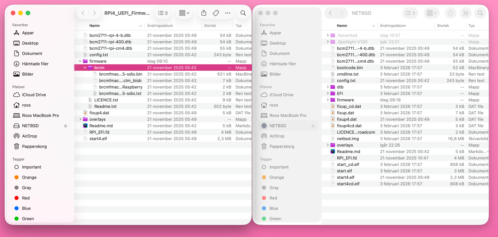
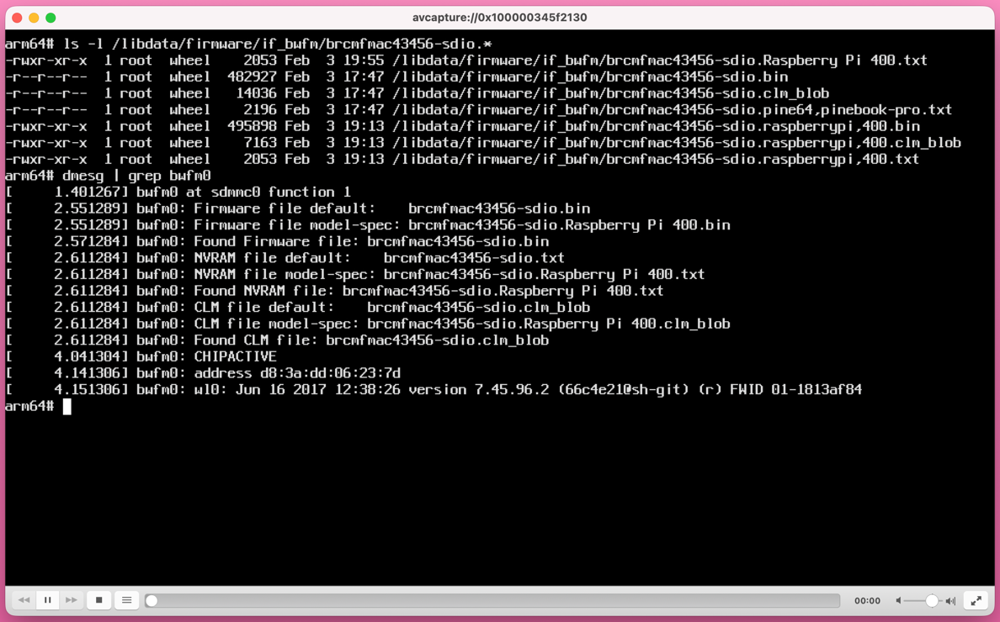
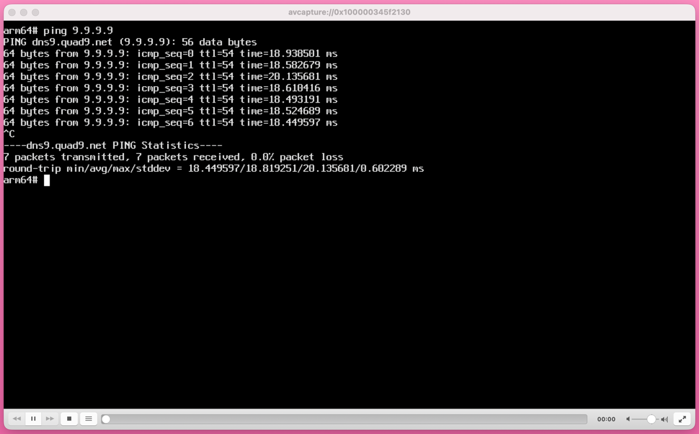

I opted to write this in the hope that it will make things easier
for some people as while there are already some guides out there
for this, many seem out of date or missing details. So, this is how
I managed to get NetBSD running (with working built-in Wi-Fi!) on
a Raspberry Pi 400. Due to similarities between the Pi 4 and Pi
400, I would expect this guide to be useful for that scenario as
well to some extent. It is important to note that the quality of
the Wi-Fi drivers still leave something to be desired. The
performance and stability definitely leave something to be desired.

The first bit is really basic: download an image and image an SD
card. There is a list of images
[here](https://wiki.netbsd.org/ports/evbarm/raspberry_pi/#index7h2)
which includes 
[the link to download the aarch64 image](https://nycdn.netbsd.org/pub/NetBSD-daily/netbsd-10/latest/evbarm-aarch64/binary/gzimg/arm64.img.gz)
.

Extract the gzipped image and write to a microSD card. Use whatever
tool is appropriate for your system, such as the `dd` command or Pi
imager tool or whatever you prefer.

Now, to this point, there's nothing special about the steps so far
at all. Here is where the tricks to make it work come in. First,
you are going to need to mount the first partition (msdos FS type)
from the microSD card you just imaged. This will be the partition
that gets mounted as `/boot` in the NetBSD system. In my case on
macOS I used `sudo mount_msdos /dev/disk2s1 ./mnt`.

You will need to download the firmware from the latest release
[here](https://github.com/pftf/RPi4), extract and copy all the
files to the mounted partition from the microSD card.



At this point, this is adequate to boot, however, Wi-Fi will still
not work, so there is one more step to take before unmounting the
microSD card and putting it in the Pi 400. Fixing the Wi-Fi requires
additional firmware from the latest release
[here](https://github.com/bsdkurt/brcm-supplemental). Extract the
files and copy to the `firmware/brcm` directory of the microSD card.
Now you can unmount the microSD card and put it into the Pi400.

There is one weird little issue still to fix. NetBSD does not want
to pick up the file `brcmfmac43456-sdio.raspberrypi,400.txt` for
some reason under that name. So, to fix this, copy all the related
firmware from `/boot`, and then just copy or symlink the
`brcmfmac43456-sdio.raspberrypi,400.txt` file to the name that
NetBSD is expecting.

```shell
cd /libdata/firmware/if_bwfm
cp /boot/FIRMWARE/BRCM/brcmfmac43456-sdio.raspberrypi* ./
cp brcmfmac43456-sdio.raspberrypi,400.txt brcmfmac43456-sdio.Raspberry\ Pi\ 400.txt
```



From here, just reboot and you should be good to go! Verify that
the interface shows up with `ifconfig` and then do all the normal
setup and connecting to Wi-Fi steps you would expect. You should
now have a Pi 400 running NetBSD with working Wi-Fi!



One important note here is that I was encountering firmware crashes
with the error `bwfm0 firmware halted` being reported. This can
happen when undervoltage occurs so make sure your powersupply is
adequate. I stopped encountering this error as soon as I started
using an appropriate powersupply. On Linux it would report errors
indicating the undervoltage condition, however no such warning was
offered with NetBSD (other than the symptomatic firmware crashing).
That said, especially as the bwfm0 interface does not recover from
the crash, I would certainly still treat this as a warning about
the overall stability of the Wi-Fi firmware.